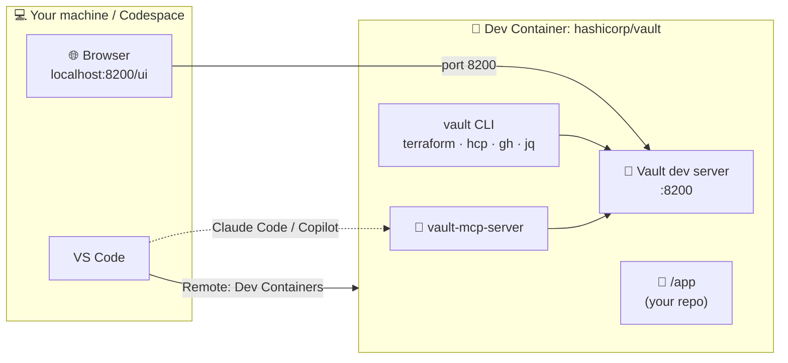

<div align="center">

# 🔐 IBM HashiCorp Vault Super Dev Container

**A ready-to-run HashiCorp Vault playground. Open it, and you have a running Vault with the tools around it.**

[](https://vscode.dev/redirect?url=vscode://ms-vscode-remote.remote-containers/cloneInVolume?url=https://github.com/star3am/ibm-hashicorp-vault-devcontainer)


</div>

---

## 🚀 Quick start

One click gets you a running Vault in your browser, with nothing to install:

[](https://codespaces.new/star3am/ibm-hashicorp-vault-devcontainer)

Prefer your own machine? See [Getting started](#-getting-started).

---

## ✨ What is this?

This is a **[Dev Container](https://containers.dev/)** for **IBM HashiCorp Vault**. When it opens, Vault is already running in dev mode, it is unsealed, you are logged in, and the CLI, UI, API, Terraform and the **Vault MCP server** are all set up. You don't need to install anything locally, follow setup guides or chase versions.

```text
 __     __          _ _
 \ \   / /_ _ _   _| | |_
  \ \ / / _` | | | | | __|
   \ V / (_| | |_| | | |_
    \_/ \__,_|\__,_|_|\__|

 * Vault v1.20.x: running
 * Vault UI:      http://localhost:8200/ui
 * Root Token:    root
```

### 👥 Who is it for?

| | |
|---|---|
| 🛠️ **Engineers** | Learn Vault, try out policies, auth methods and secrets engines, and develop against a real Vault API in seconds. If you break it, rebuild and it's clean again. |
| ⚙️ **CI / GitHub Actions** | Use the same image in your pipelines to run integration tests against a real Vault, so your laptop and CI behave the same. |
| 📊 **Decision makers, evaluators and sales** | A **hands-on proof of concept**. Instead of reading datasheets, open the UI, store a secret, encrypt data, lock down access with a policy, and get answers to questions about Vault quickly. This makes it easier to decide on Vault. |

---

## 🧰 Tools included

Everything below is already installed when the container opens.

### HashiCorp

| Tool | Version | What it's for | Try it |
|---|---|---|---|
| **Vault** server + CLI | `latest` image, set with the `VAULT_VERSION` build arg | Secrets management. Runs in the background in **dev mode**: in-memory, unsealed, root token `root`. Its logs are in `/tmp/vault.log` | `vault status` |
| **Vault UI** | Same as Vault | Web console for secrets, policies and auth methods | [localhost:8200/ui](http://localhost:8200/ui) |
| **Vault MCP Server** | `0.2.0`, set with the `VAULT_MCP_SERVER_VERSION` build arg | Lets AI assistants (Claude Code, Copilot agent mode) operate Vault through plain-language prompts | `vault-mcp-server --version` |
| **Terraform** | Latest release when the image is built | Manage Vault as code with the [Vault provider](https://registry.terraform.io/providers/hashicorp/vault/latest/docs) | `terraform version` |
| **HCP CLI** (`hcp`) | Latest release when the image is built | Sign in to HashiCorp Cloud Platform and manage organisations, projects, IAM and service principals | `hcp auth login` |

### Code quality & security

| Tool | Version | What it's for | Try it |
|---|---|---|---|
| **pre-commit** | Alpine package | Runs the git hooks in `.pre-commit-config.yaml` on every commit | `pre-commit run --all-files` |
| **gitleaks** | Latest release when the image is built | Finds leaked secrets (Vault tokens, cloud keys) before they reach Git history | `gitleaks git --redact` |
| **shellcheck** | Alpine package | Finds bugs in shell scripts | `shellcheck script.sh` |

### Developer essentials

| Tool | Version | What it's for | Try it |
|---|---|---|---|
| **GitHub CLI** (`gh`) | Alpine package | Repos, PRs, Issues and Actions from the terminal | `gh auth login` |
| **git**, **gnupg**, **openssh** | Alpine package | Version control, signed commits and SSH. Your host's `~/.ssh` and `~/.gnupg` are mounted into the container | `git log --show-signature` |
| **jq** | Alpine package | Slice and filter Vault's JSON output | `vault secrets list -format=json \| jq 'keys'` |
| **curl** | Alpine package | Call the Vault HTTP API directly | `curl -s $VAULT_ADDR/v1/sys/health \| jq` |
| **openssl** | Alpine package | Inspect certificates, generate keys and random data | `openssl rand -base64 32` |
| **vim**, **less**, **bash-completion** | Alpine package | Editing, paging and tab completion | `vault <TAB><TAB>` |

### Built-in helpers

| Command | What it does | Example |
|---|---|---|
| `vexport` | Sets a variable in **every** open terminal | `vexport VAULT_NAMESPACE=admin` |
| `vunset` | Removes a variable from every open terminal | `vunset VAULT_NAMESPACE` |
| `vault login` | Changes the token for **all** terminals, because it's stored in `~/.vault-token` | `echo root \| vault login -` |
| Welcome banner | Shows Vault status, the UI URL, your current token and common commands in every new terminal | Open a new terminal |

> [!TIP]
> Show every installed version at once:
> ```bash
> for t in vault terraform hcp vault-mcp-server gh pre-commit gitleaks; do printf '%-17s ' "$t"; { $t --version 2>/dev/null || $t version; } | grep -m1 -E '[0-9]+\.[0-9]+'; done
> ```

### VS Code extensions (installed automatically)

| Extension | Why |
|---|---|
| `hashicorp.hcl` | Syntax highlighting for Vault policies and config (`.hcl`) |
| `hashicorp.terraform` | Terraform language server, plus the HCP Terraform view |
| `owenfarrell.vscode-vault` | **Vault browser in the sidebar**: browse, read, write and copy secrets without leaving VS Code |
| `hashicorp.sentinel` | Syntax highlighting for Sentinel policy-as-code (Vault Enterprise / HCP) |
| `hashicorp.vault-radar` | **HCP Vault Radar**: flags hard-coded secrets in your code as you type. Needs a Vault Radar licence |
| `anthropic.claude-code` | Claude Code AI assistant, works with the Vault MCP server |
| `redhat.vscode-yaml` | YAML editing for compose files and GitHub workflows |
| `johnpapa.vscode-peacock` | The Vault-yellow theme, so you always know you're in the Vault container |
| `nhoizey.gremlins` | Finds invisible or odd characters that break configs |
| `dbaeumer.vscode-eslint`, `esbenp.prettier-vscode` | Linting and formatting |

---

## 🏗️ How it fits together



---

## 🧭 Getting started

### Option 1: GitHub Codespaces (no local install)

1. Click **[Open in GitHub Codespaces](https://codespaces.new/star3am/ibm-hashicorp-vault-devcontainer)**.
2. Wait for the container to build. The welcome banner shows the Vault UI URL.
3. That's it.

### Option 2: Local VS Code

**Prerequisites:** [Docker Desktop](https://www.docker.com/products/docker-desktop/) (or Rancher / Podman) and [VS Code](https://code.visualstudio.com/) with the [Dev Containers](https://marketplace.visualstudio.com/items?itemName=ms-vscode-remote.remote-containers) extension.

```bash
git clone git@github.com:star3am/ibm-hashicorp-vault-devcontainer.git
code ibm-hashicorp-vault-devcontainer
```

When VS Code prompts you, click **Reopen in Container**, or run `F1` → **Dev Containers: Reopen in Container**.

> [!NOTE]
> The compose file mounts `~/.ssh` and `~/.gnupg` from your host so `git` push and commit signing work inside the container. Make sure both folders exist on your host.

### Log in to the UI

Open **http://localhost:8200/ui**, choose **Token**, and enter `root`.

---

## 📦 Use it in your own repo

You can add Vault to any existing project. The **`.devcontainer/` folder is self-contained** and all its paths are relative, so you only need to copy that folder. Your repo is mounted at `/app` inside the container, whatever it's called.

### Option A: one command (macOS, Linux, WSL)

Run this from the root of your repo:

```bash
curl -fsSL https://github.com/star3am/ibm-hashicorp-vault-devcontainer/archive/refs/heads/main.tar.gz \
  | tar -xz --strip-components=1 \
      ibm-hashicorp-vault-devcontainer-main/.devcontainer \
      ibm-hashicorp-vault-devcontainer-main/.pre-commit-config.yaml
```

To get only the container, without the git hooks, drop the `.pre-commit-config.yaml` line.

### Option B: copy it by hand

1. [Download this repo as a ZIP](https://github.com/star3am/ibm-hashicorp-vault-devcontainer/archive/refs/heads/main.zip), or clone it.
2. Copy the **`.devcontainer/`** folder into the root of your repo.
3. *(Optional)* Copy **`.pre-commit-config.yaml`** to get the commit checks.

### Then

```bash
git add .devcontainer
git commit -m "Add HashiCorp Vault Dev Container"
```

Open the repo in VS Code and click **Reopen in Container**, or push it and launch a **Codespace**. Vault is running and your code is at `/app`.

Your repo should end up like this:

```text
your-repo/
├── .devcontainer/            ← copied as-is, no edits needed
│   ├── devcontainer.json
│   ├── docker-compose.yml
│   ├── Dockerfile
│   └── etc/
├── .pre-commit-config.yaml   ← optional
└── ...your code
```

> [!IMPORTANT]
> **Already have a `.devcontainer/` folder?** Don't overwrite it. Copy this one to `.devcontainer/vault/` instead. VS Code will then ask which container to open. Make one edit: in `docker-compose.yml`, change the `"../:/app"` volume to `"../../:/app"`, since the folder is now one level deeper.

**Good to know**

- **Git hooks** are only installed if your repo has a `.pre-commit-config.yaml`. Repos without one aren't affected.
- **Your `.gitignore`**: copy the *Vault* and *Terraform* blocks from [ours](.gitignore) so tokens and state files never get committed.
- **Workspace colours**: the yellow theme comes from `devcontainer.json`, so it comes with you. `.vscode/settings.json` is optional.
- **Port 8200** must be free on your machine. Run one Vault dev container at a time, or change the port mapping in `docker-compose.yml`.

---

## ⌨️ Handy commands

The welcome banner shows these every time you open a terminal.

```bash
vault status                              # Is Vault up? Sealed? Version?
vault secrets list                        # What secrets engines are enabled?
vault kv put secret/hello foo=bar         # Write a secret
vault kv get secret/hello                 # Read it back
vault print token                         # Which token am I using?
gh auth login                             # Log in to GitHub
hcp auth login                            # Log in to HashiCorp Cloud Platform
```

### Shared terminal environment

Every terminal shares one Vault session:

- **`vault login`** in any terminal applies to **all** terminals. The token lives in `~/.vault-token`; `VAULT_TOKEN` is deliberately not set.
- **`vexport`** and **`vunset`** set or remove a variable in **every** terminal, including ones already open. The change takes effect at their next prompt.

```bash
vexport VAULT_NAMESPACE=admin             # Set in all terminals
vexport VAULT_ADDR=https://my-vault:8200  # Point every terminal somewhere else
vunset  VAULT_NAMESPACE                   # Remove from all terminals
```

Shared variables are stored in `~/.vault.env`.

---

## 🎯 Guided tour: a 10-minute proof of concept

These steps cover what evaluators usually ask about. Run them in the terminal, then look at the result in the UI.

<details>
<summary><b>1. 🗝️ Store and version secrets (KV v2)</b>: <i>"Where do our secrets live, and can we see the history?"</i></summary>

```bash
vault kv put secret/myapp/db username=app password=v1
vault kv put secret/myapp/db username=app password=v2
vault kv get secret/myapp/db                 # latest version
vault kv get -version=1 secret/myapp/db      # previous version
vault kv metadata get secret/myapp/db        # full version history
```
</details>

<details>
<summary><b>2. 🛡️ Least-privilege access with policies</b>: <i>"Can we restrict who sees what?"</i></summary>

```bash
# A policy that can only READ one secret
vault policy write readonly - <<'EOF'
path "secret/data/myapp/*" {
  capabilities = ["read"]
}
EOF

# A human user that gets that policy
vault auth enable userpass
vault write auth/userpass/users/alice password=s3cret policies=readonly

# Log in as alice without replacing your root session
ALICE=$(vault login -token-only -method=userpass username=alice password=s3cret)

VAULT_TOKEN=$ALICE vault kv get secret/myapp/db             # ✅ allowed
VAULT_TOKEN=$ALICE vault kv put secret/myapp/db password=x  # ❌ permission denied
```
</details>

<details>
<summary><b>3. 🔒 Encryption as a Service (Transit)</b>: <i>"Can apps encrypt data without managing keys?"</i></summary>

```bash
vault secrets enable transit
vault write -f transit/keys/orders

CT=$(vault write -field=ciphertext transit/encrypt/orders \
      plaintext=$(echo -n "4111-1111-1111-1111" | base64))
echo "$CT"                                    # vault:v1:...  (safe to store in your DB)

vault write -field=plaintext transit/decrypt/orders ciphertext="$CT" | base64 -d

vault write -f transit/keys/orders/rotate     # Rotate the key; old data still decrypts
```
</details>

<details>
<summary><b>4. 🧾 Audit everything</b>: <i>"Can we prove who accessed what?"</i></summary>

```bash
vault audit enable file file_path=/tmp/vault-audit.log
vault kv get secret/myapp/db > /dev/null
tail -n 1 /tmp/vault-audit.log | jq '.request | {path, operation, remote_address}'
```
</details>

<details>
<summary><b>5. 🏗️ Vault as Code with Terraform</b>: <i>"Can we manage this through GitOps?"</i></summary>

```hcl
# main.tf
provider "vault" {}   # reads VAULT_ADDR and ~/.vault-token

resource "vault_mount" "kv" {
  path = "team-a"
  type = "kv-v2"
}

resource "vault_policy" "team_a" {
  name   = "team-a"
  policy = <<-EOT
    path "team-a/*" { capabilities = ["create", "read", "update", "list"] }
  EOT
}
```

```bash
terraform init && terraform apply
```
</details>

> [!TIP]
> Made a mess? Dev mode keeps everything in memory. **Rebuild or restart the container** to get a clean Vault.

---

## 🤖 Vault MCP Server (AI assistants)

The [Vault MCP Server](https://developer.hashicorp.com/vault/ai/mcp-server) is installed at `/usr/local/bin/vault-mcp-server`. It lets an AI assistant manage mounts, read and write secrets, and so on, through plain-language prompts such as:

> *"List all secrets engines, then create a KV v2 mount called `payments` and add a secret `api-key` to it."*

**VS Code (Copilot agent mode)** is preconfigured in `devcontainer.json`, so nothing needs doing.

**Claude Code**: register it once:

```bash
claude mcp add vault \
  -e VAULT_ADDR=http://127.0.0.1:8200 \
  -e VAULT_TOKEN=root \
  -- vault-mcp-server stdio
```

Then run `/mcp` inside Claude Code to confirm it's connected.

> [!WARNING]
> The MCP server is configured with the **root** token for convenience in this sandbox. Never give an AI assistant a root token against a real Vault. Use a scoped token with a narrow policy.

---

## 🗂️ Browse Vault from the VS Code sidebar

The **HashiCorp Vault** extension (`owenfarrell.vscode-vault`) adds a Vault view to the Activity Bar, so you can browse and edit secrets as a tree. This is useful in demos for people who would rather not use the terminal.

1. Open the **Vault** view in the Activity Bar and add a server: `http://127.0.0.1:8200`.
2. Choose **native** (token) authentication and use `root`. You can also use **userpass** with a user from the [guided tour](#-guided-tour-a-10-minute-proof-of-concept).
3. Expand `secret/` to browse, read, write and copy secrets. Copied values are cleared from the clipboard after 60 seconds.

## 🕵️ HCP Vault Radar (optional, licensed)

The **HCP Vault Radar** extension scans the code you're writing for hard-coded secrets, such as API keys, passwords and tokens. It can also tell you whether a leaked secret is already stored in Vault. It needs a [Vault Radar licence](https://developer.hashicorp.com/hcp/docs/vault-radar/ide/install/vscode). Without one it stays installed and does nothing, so you can ignore it.

To activate it, do one of the following:

- Open **Settings**, search for **Vault Radar**, and paste your licence key or the path to your licence file.
- In GitHub Codespaces, add a [Codespaces secret](https://docs.github.com/en/codespaces/managing-your-codespaces/managing-your-account-specific-secrets-for-github-codespaces) named `VAULT_RADAR_LICENSE`. Codespaces injects it as an environment variable, and the extension reads that variable.

> [!NOTE]
> Vault Radar is published only on the Visual Studio Marketplace. VS Code forks that use Open VSX, such as Cursor or VSCodium, will skip it.

---

## ☁️ HashiCorp Cloud Platform (HCP)

### Sign in with the HCP CLI

The `hcp` CLI handles your HCP account: sign-in, organisations, projects, IAM and service principals.

```bash
hcp auth login                           # opens a browser / prints a login URL
hcp profile init                         # pick your organisation and project
hcp projects list
hcp iam service-principals list
```

For CI, sign in non-interactively with a service principal:

```bash
hcp auth login --client-id="$HCP_CLIENT_ID" --client-secret="$HCP_CLIENT_SECRET"
```

### Connect to HCP Vault Dedicated

An **HCP Vault Dedicated** cluster is a normal Vault behind a URL, so you talk to it with the `vault` CLI, the UI, Terraform, the MCP server and the sidebar browser, just like the local dev server. Point every terminal at it:

```bash
vexport VAULT_ADDR=https://<your-cluster>.hashicorp.cloud:8200
vexport VAULT_NAMESPACE=admin            # HCP Vault's top-level namespace
vault login                              # paste an admin token from the HCP portal
vault status
```

To switch back to the local dev server:

```bash
vunset VAULT_NAMESPACE
vexport VAULT_ADDR=http://127.0.0.1:8200
echo root | vault login -
```

---

## ✅ Pre-commit hooks

The [pre-commit](https://pre-commit.com/) git hooks install automatically when the container starts. Every `git commit` runs the checks in [`.pre-commit-config.yaml`](.pre-commit-config.yaml):

| Check | Catches |
|---|---|
| **gitleaks** | Vault tokens, cloud keys and other secrets before they reach Git history |
| **detect-private-key** | Accidentally staged private keys |
| **shellcheck** | Bugs in shell scripts |
| **check-yaml / check-json** | Broken `docker-compose.yml`, workflows and `devcontainer.json` |
| **terraform fmt** | Unformatted Terraform (`*.tf`) |
| **vault policy fmt** | Unformatted Vault policies under `policies/*.hcl` |
| Whitespace, line-ending and end-of-file fixers | Noisy diffs |

```bash
pre-commit run --all-files     # run every check now
pre-commit autoupdate          # bump hook versions
git commit --no-verify         # skip hooks (emergencies only!)
```

---

## ⚙️ Using it in GitHub Actions

Run your tests inside the exact same environment with [`devcontainers/ci`](https://github.com/devcontainers/ci):

```yaml
# .github/workflows/vault-tests.yml
name: Vault integration tests
on: [push, pull_request]

jobs:
  test:
    runs-on: ubuntu-latest
    steps:
      - uses: actions/checkout@v4

      - name: Run tests in the Vault Dev Container
        uses: devcontainers/ci@v0.3
        with:
          runCmd: |
            vault status
            vault kv put secret/ci hello=world
            vault kv get secret/ci
            # ./run-your-tests.sh
```

---

## 🔧 Configuration

| What | Where | Default |
|---|---|---|
| Vault version | `VAULT_VERSION` build arg in `.devcontainer/Dockerfile` | `latest` |
| Vault MCP Server version | `VAULT_MCP_SERVER_VERSION` build arg | `0.2.0` |
| Root token | `VAULT_DEV_ROOT_TOKEN_ID` in the Dockerfile | `root` |
| Port | `docker-compose.yml` / `devcontainer.json` | `8200` |
| Extensions & theme | `customizations.vscode` in `devcontainer.json` | Vault yellow `#ffcf25` |

After changing any of these, run `F1` → **Dev Containers: Rebuild Container**.

---

## 📁 Project structure

```text
.
├── .devcontainer/
│   ├── devcontainer.json          # VS Code config, extensions, MCP server, ports
│   ├── docker-compose.yml         # Runs Vault in dev mode, mounts your repo + ssh/gpg
│   ├── Dockerfile                 # hashicorp/vault + tools + Terraform + MCP server
│   └── etc/
│       ├── profile.d/vault-env.sh     # vexport / vunset shared-terminal helpers
│       └── update-motd.d/00-header    # The welcome banner
├── .vscode/settings.json          # Vault-yellow workspace theme
├── .gitignore
└── README.md
```

---

## 🩺 Troubleshooting

| Symptom | Fix |
|---|---|
| Banner says **not reachable** | Vault may still be starting: wait a few seconds and run `vault status`. If it stays down, `cat /tmp/vault.log` shows why. |
| `permission denied` everywhere | Your token changed. Run `vault print token`, then `echo root \| vault login -`. |
| Port 8200 already in use | Another Vault is running on your host. Stop it, or change the port mapping in `docker-compose.yml`. |
| Variables "stuck" from earlier | Run `cat ~/.vault.env`, then `vunset <NAME>`. |
| `git push` fails inside the container | Check that `~/.ssh` exists on the host and holds your key, or run `gh auth login`. |

---

## ⚠️ Security notice

This container runs Vault in **dev mode**: in-memory storage, auto-unsealed, TLS disabled, and a well-known root token. That is ideal for learning, demos and CI. It is **never** suitable for production or real secrets. For production, see the [Vault production hardening guide](https://developer.hashicorp.com/vault/docs/concepts/production-hardening) or use [HCP Vault Dedicated](https://developer.hashicorp.com/hcp/docs/vault).

---

## 📚 Learn more

- 📖 [Vault documentation](https://developer.hashicorp.com/vault/docs)
- 🎓 [Vault tutorials](https://developer.hashicorp.com/vault/tutorials)
- 🤖 [Vault MCP Server](https://developer.hashicorp.com/vault/ai/mcp-server)
- 🏗️ [Terraform Vault provider](https://registry.terraform.io/providers/hashicorp/vault/latest/docs)
- 🐳 [Dev Containers specification](https://containers.dev/)

## 🙏 Credits

Inspired by:

- [star3am/hashiqube](https://github.com/star3am/hashiqube): *HashiQube*, a hands-on DevOps lab that runs every HashiCorp product in a GitHub Codespace or Docker container
- [hashicorp/vault#31578](https://github.com/hashicorp/vault/pull/31578): *Feature: adding a Dev Container to Vault*, my PR to the Vault project
- [btkrausen/vault-codespaces](https://github.com/btkrausen/vault-codespaces)
- [star3am/k3s-devcontainer](https://github.com/star3am/k3s-devcontainer)

---

## 👋 About Me

My name is **Riaan Nolan**. I'm a DevOps engineer, born in South Africa and now based in Brisbane, Australia. I started as a web developer in 2000, moved into systems administration, and since then have focused on automation, and on infrastructure and configuration as code. Along the way I've worked for multinational companies in Portugal, Germany, China, South Africa, the United States and Australia, often with distributed teams. I was a Director of DevOps in South Africa, then moved to Australia and went back to hands-on engineering.

I've been a **HashiCorp Ambassador** since 2021, and I'm a **HashiCorp Core Contributor** and **Certified Terraform Instructor**, with Vault and Terraform certifications. I'm passionate about the DevOps movement and about building proof-of-concept projects that let people *learn by doing*. That's why I created [**HashiQube**](https://github.com/star3am/hashiqube), and it's the idea behind this Super Dev Container too.

Connect with me on [LinkedIn](https://www.linkedin.com/in/riaannolan/), see my certifications on [Credly](https://www.credly.com/users/riaan-nolan.e657145c), or find my talks on [Sessionize](https://sessionize.com/riaan-nolan).

<p align="center">
  
</p>

<div align="center">

Made with 💛 by **[Riaan Nolan](https://github.com/star3am)**

</div>
